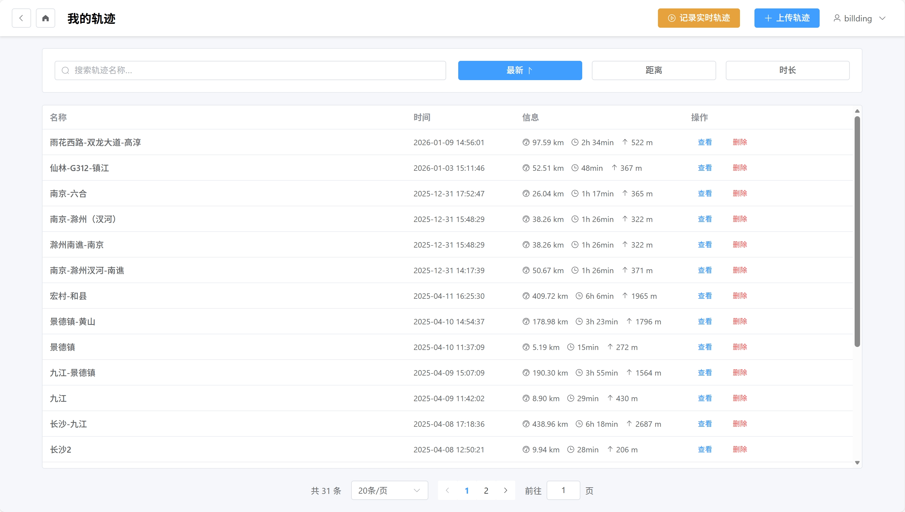
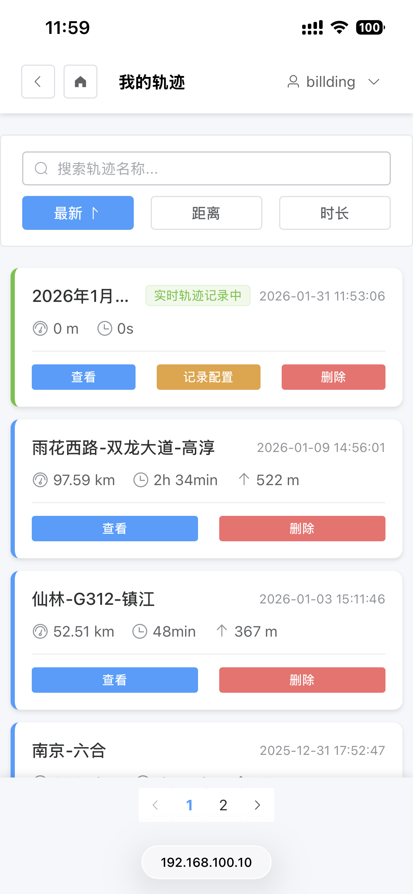

# Vibe Route - 轨迹管理系统

> 本项目还在进行中。使用 Claude Code + GLM Coding Plan 生成。  
> 🚀 速来拼好模，智谱 GLM Coding 超值订阅，邀你一起薅羊毛！Claude Code、Cline 等 20+ 大编程工具无缝支持，“码力”全开，越拼越爽！立即开拼，享限时惊喜价！链接：https://www.bigmodel.cn/glm-coding?ic=AGNTPPSX90

基于 [gpxutil](https://github.com/DingJunyao/gpxutil) 构建的全栈 Web 轨迹管理系统。

每一次旅程都是生命中独一无二的叙事。从山峦叠嶂到城市街巷，从晨光熹微到暮色四合，足迹在时空之中交织出属于自己的轨迹。这些轨迹不仅记录了走过的距离，更承载着沿途的风景、心境与回忆。

Vibe Route 旨在将这些数字化的足迹转化为可被感知、被分享、被珍藏的记忆。系统将地理坐标、海拔变化、速度节奏等多维数据融合，让平面的线条在地图上重新呼吸。

无论是独自探索的远足，每一次呼吸都与山林同频；或是与朋友共享的骑行，车轮转动间传递着欢笑与默契；亦或是自驾追寻远方，引擎的轰鸣伴随夕阳的余晖——每一条轨迹都成为个人行走的诗篇。

技术架构的精心设计支撑着这一愿景。双层加密确保数据安全，多坐标系的自由适应让地理表达更加精准，而 Web 端的可视化与生成功能则赋予了创作者丰富的表达空间。从原始的 GPX 文件到精美的覆盖层，从单一的数据点到完整的叙事弧线，系统始终致力于为创作者提供最流畅的体验。

这不仅仅是一个轨迹管理系统，更是一个个人历史档案馆，一个行走记忆的数字化画布。

## 项目截图

### PC Web 端





### 移动 Web 端

 

 

## 项目进度

### 已完成 ✅

#### 核心功能

- [x] 项目基础架构搭建
- [x] 数据库模型设计（支持 SQLite/MySQL/PostgreSQL + PostGIS）
- [x] JWT 认证系统（双重加密：前端 SHA256 + 后端 bcrypt）
- [x] 用户注册和登录
- [x] 首位用户自动成为管理员
- [x] 邀请码系统

#### 轨迹管理

- [x] 轨迹上传（支持 GPX/CSV/XLSX/KML/KMZ 格式）
- [x] 轨迹列表（分页、搜索、排序）
- [x] 轨迹详情查看
- [x] 轨迹编辑（名称、描述、坐标系）
- [x] 轨迹导出（GPX/CSV/XLSX/KML）
- [x] 轨迹删除
- [x] 多坐标系支持（WGS84/GCJ02/BD09）
- [x] 坐标系转换
- [x] 地理编码填充
- [x] 异步任务处理（大文件处理）

#### 地图可视化

- [x] 多地图引擎支持（高德地图 / 百度地图 / 腾讯地图 / Leaflet（包括但不限于天地图 / OpenStreetMap））
- [x] 轨迹路径绘制
- [x] 地图与图表双向同步
- [x] 经过区域点击高亮
- [x] 响应式地图设计
- [x] 地图居中按钮
- [x] 轨迹分享页、HTML 元素嵌入

#### 统计图表

- [x] 海拔剖面图
- [x] 速度曲线图
- [x] 轨迹点统计信息

#### 实时记录

- [x] 实时轨迹记录会话管理
- [x] GPS Logger 集成
- [x] WebSocket 实时推送
- [x] 实时上传状态显示
- [x] 自动重连机制

#### 后台管理

- [x] 用户管理（列表、搜索、筛选）
- [x] 用户权限管理（管理员设置、禁用/启用）
- [x] 密码重置
- [x] 系统配置（注册开关、地图配置）
- [x] 邀请码管理
- [x] 道路标志字体管理

#### 特色功能
- [x] 道路标志生成（普通道路/高速公路）
- [x] 轨迹覆盖层生成（信息叠加图）
- [x] 经过区域树形展示（省/市/区/道路）
- [x] 远程日志调试
- [x] 响应式设计（PC + 移动端适配）

### 实现中（实现了基本功能）

- [ ] 路径插值：用于隧道等无信号的地方
- [ ] 轨迹海报 / 截图生成
- [ ] 在线编辑地理信息

### 待实现 🚧

- [ ] 轨迹动画
- [ ] 覆盖层生成与配置
- [ ] ……

## 功能特性

### 用户认证与管理

- **双重加密安全**：密码在前端使用 SHA256 加密，后端使用 bcrypt 二次哈希存储
- **自动管理员**：系统首位注册用户自动成为管理员
- **邀请码机制**：可选的邀请码验证系统，管理员可创建和管理邀请码
- **用户保护**：不能操作自己（修改管理员状态、禁用、删除），保护首位用户

### 轨迹管理

- **多格式上传**：支持 GPX、CSV、XLSX、KML、KMZ 格式
- **GPS Logger 兼容**：支持 GPS Logger CSV 格式
- **多坐标系支持**：同时存储 WGS84/GCJ02/BD09 三种坐标系
- **坐标转换**：支持坐标系之间的互转
- **地理编码**：自动填充行政区划和道路信息
- **轨迹编辑**：修改名称、描述、原始坐标系
- **多格式导出**：
  - GPX：标准格式，支持选择坐标系
  - CSV：UTF-8 编码带 BOM，确保 Excel 正确显示中文
  - XLSX：本项目导出格式
  - KML：Google gx:Track 扩展，支持两步路导入

### 地图可视化

- **多地图引擎**：支持高德地图、百度地图、腾讯地图、Leaflet
- **自动坐标适配**：根据底图自动使用对应坐标系
- **轨迹路径绘制**：在地图上显示轨迹路径
- **交互功能**：
  - 悬停显示轨迹信息（首页）
  - 点击显示点信息（详情页）
  - 地图与图表双向同步
- **经过区域**：按行政层级（省→市→区→道路）树形展示
- **区域高亮**：点击树节点高亮对应轨迹段
- **响应式设计**：自适应不同屏幕尺寸

### 实时记录

- **会话管理**：创建、结束、删除实时记录会话
- **Token 认证**：生成长期有效的上传 token，无需登录即可上传
- **GPS Logger 集成**：兼容 GPS Logger 等应用的上传格式
- **单点上传**：支持 GET/POST 上传单个轨迹点
- **批量上传**：支持 GPX 文件批量上传
- **WebSocket 实时推送**：
  - `connected`：连接成功
  - `point_added`：新点添加
  - `stats_updated`：统计更新
- **自动重连**：连接断开后 3 秒自动重连
- **实时状态显示**：轨迹列表和详情页直接显示上传状态

### 后台管理

- **用户管理**：分页列表、搜索、排序、筛选
- **权限管理**：
  - 设置/取消管理员
  - 启用/禁用用户
  - 重置用户密码
  - 删除用户（软删除）
- **系统配置**：
  - 注册开关
  - 邀请码要求
  - 地图提供商
  - 地图层配置
  - 道路标志字体设置
- **邀请码管理**：创建、查看列表、删除

### 特色功能

- **道路标志生成**：
  - 普通道路：G/S/X + 三位数字
  - 国家高速：G + 1-4 位数字
  - 省级高速：S + 纯数字或 S + 字母 + 可选数字（仅限四川省）
  - 高质量 SVG 矢量输出

- **轨迹覆盖层生成**：
  - 生成带有轨迹信息的 PNG 图片序列
  - 自定义图片尺寸、字体大小
  - 支持显示坐标、海拔、道路信息
  - 异步任务处理，完成后下载 ZIP 包

- **远程日志调试**：
  - 前端日志实时推送
  - 自动解析日志标签（如 [AMap]）
  - 移动端通过 URL 参数 `?remote-log` 启用
  - 电脑端访问 `/log-viewer` 查看实时日志

- **响应式设计**：
  - 移动端断点：1366px
  - 卡片列表替代表格
  - 触摸友好的交互
  - 地图自动重绘

## 技术栈

### 后端

- **FastAPI** + Python 3.11+ - 现代 Web 框架
- **SQLAlchemy** + Alembic - ORM 和数据库迁移
- **JWT** - 用户认证
- **WebSocket** - 实时通信
- **gpxutil** - 轨迹处理核心（参考）

**数据库支持**：

| 驱动 | 用途 | x86/x64 | ARM (树莓派) |
|------|------|---------|--------------|
| `aiosqlite` | SQLite 异步 | ✅ wheel | ✅ wheel |
| `asyncmy` | MySQL 异步（高性能） | ✅ wheel | ❌ 需 Rust 编译 |
| `aiomysql` | MySQL 异步（纯 Python） | ✅ | ✅ wheel |
| `asyncpg` | PostgreSQL 异步 | ✅ wheel | ❌ 需编译 |
| `pymysql` | Alembic 迁移（MySQL） | ✅ | ✅ wheel |
| `psycopg2-binary` | Alembic 迁移（PostgreSQL） | ✅ wheel | ❌ 需编译 |

**支持的数据库**：

- SQLite（默认）
- MySQL
- PostgreSQL + PostGIS（空间扩展）

### 前端

- **Vue 3** + TypeScript + Vite - 渐进式框架
- **Element Plus** - UI 组件库
- **Pinia** - 状态管理
- **Vue Router** - 路由管理
- **Axios** - HTTP 客户端
- **ECharts** - 数据可视化

**地图引擎**：

- 高德地图 (AMap GL)
- 百度地图 (BMapGL)
- 腾讯地图 (TMap GL)
- Leaflet + OpenStreetMap

## 快速开始

### 后端启动

**ARM 架构（树莓派、Termux + proot-distro 等）**：

> **重要提示**：
> 1. **bcrypt 版本**：需固定在 3.x（`bcrypt>=3.2.0,<4.0.0`），与 passlib 1.7.4 兼容
> 2. **svgpathtools 来源**：需从 GitHub 特定仓库安装
> 3. **piwheels 问题**：某些包存在元数据损坏，建议直接从 PyPI 安装

```bash
cd backend

# 1. 安装 Rust 工具链（编译 bcrypt、asyncmy 等）
curl --proto '=https' --tlsv1.2 -sSf https://sh.rustup.rs | sh
source $HOME/.cargo/env

# 2. 安装系统编译依赖
sudo apt-get install -y build-essential libffi-dev python3-dev libpq-dev python3.13-venv

# 3. 创建虚拟环境
python3 -m venv venv
source venv/bin/activate

# 4. 从 PyPI 安装所有依赖（避免 piwheels 元数据问题）
pip install fastapi uvicorn[standard] sqlalchemy alembic aiosqlite asyncmy aiomysql asyncpg pymysql psycopg2-binary bcrypt>=3.2.0,<4.0.0 python-jose[cryptography] passlib[bcrypt] python-dotenv celery redis pydantic pydantic-settings email-validator httpx aiofiles requests gpxpy lxml pandas geopandas shapely svgwrite fonttools pillow cairosvg imageio numpy tqdm pyyaml pypinyin loguru openpyxl pytest pytest-asyncio rarfile slowapi python-multipart --index-url https://pypi.org/simple

# 5. svgpathtools 从 GitHub 安装（PyPI 版本不兼容）
pip install "svgpathtools @ https://github.com/bcwhite-code/svgpathtools/archive/refs/heads/master.zip"

# 6. 安装 Playwright
pip install playwright==1.58.0
playwright install chromium

# 7. 安装 Playwright 系统依赖
sudo apt-get install -y libnspr4 libnss3 libatk1.0-0t64 libatk-bridge2.0-0t64 libcups2t64 libxcb1 libxkbcommon0 libatspi2.0-0t64 libx11-6 libxcomposite1 libxdamage1 libxext6 libxfixes3 libxrandr2 libgbm1 libcairo2 libpango-1.0-0 libasound2t64

# 8. 复制配置文件
cp .env.example .env

# 9. 创建数据目录
mkdir -p data/uploads data/temp data/exports data/road_signs

# 10. 初始化数据库（使用 SQLAlchemy 创建表）
python -c "
import asyncio
from app.core.database import engine
from app.models import Base

async def init_db():
    async with engine.begin() as conn:
        await conn.run_sync(Base.metadata.create_all)

asyncio.run(init_db())
print('数据库初始化成功!')
"

# 11. 设置 alembic 版本标记
python -c "
import sqlite3
conn = sqlite3.connect('data/vibe_route.db')
cursor = conn.cursor()
cursor.execute('CREATE TABLE IF NOT EXISTS alembic_version (version_num VARCHAR(32) NOT NULL)')
cursor.execute('INSERT INTO alembic_version (version_num) VALUES (' + "'"'014_add_interpolations' + "'" + '))
conn.commit()
print('Alembic 版本已设置: 014_add_interpolations')
"

# 12. 运行开发服务器
uvicorn app.main:app --reload
```

> **Termux + proot-distro 用户**：请参考 [doc/termux-deployment.md](./doc/termux-deployment.md) 获取详细的部署指南和常见问题解决。

**x86/x64 架构**：

```bash
cd backend

# 创建虚拟环境
python -m venv venv
source venv/bin/activate  # Windows: venv\Scripts\activate

# 安装依赖
pip install -r requirements.txt

# 复制配置文件
cp .env.example .env

# 创建数据目录
mkdir -p data/uploads data/temp data/exports data/road_signs

# 数据库迁移（首次启动或模型变更时）
alembic upgrade head

# 运行开发服务器
uvicorn app.main:app --reload
```

后端将运行在 `http://localhost:8000`

API 文档：`http://localhost:8000/docs`

### 前端启动

```bash
cd frontend

# 安装依赖
npm install

# 运行开发服务器
npm run dev
```

前端将运行在 `http://localhost:5173`

## 内网穿透配置

当你需要通过内网穿透（如 frp、ngrok）访问前端服务时，需要配置环境变量以解决 WebSocket 连接问题。

### 配置步骤

1. 复制环境变量模板：

   ```bash
   cd frontend
   cp .env.example .env.local
   ```

2. 编辑 `.env.local`，填入你的域名：

   ```env
   # 完整的访问地址（协议 + 域名）
   VITE_ORIGIN=https://your-domain.com

   # 禁用 HMR（内网穿透环境下 WebSocket 连接不稳定，建议禁用）
   VITE_DISABLE_HMR=true

   # 允许的主机列表（逗号分隔）
   VITE_ALLOWED_HOSTS=your-domain.com,.your-domain.com
   ```

3. 重启开发服务器使配置生效。

### 配置说明

| 变量 | 说明 |
| --- | --- |
| `VITE_ORIGIN` | 设置服务器的原始访问地址，Vite 会用它来生成资源链接 |
| `VITE_DISABLE_HMR` | 禁用热模块替换（HMR），内网穿透对 WebSocket 支持有限，禁用后需手动刷新浏览器 |
| `VITE_ALLOWED_HOSTS` | 允许访问的主机列表，防止 Host 攻击 |

### 注意事项

- `.env.local` 文件不会被 Git 跟踪（已在 `.gitignore` 中），不会泄露域名信息
- 禁用 HMR 后，代码修改需要**手动刷新浏览器**才能看到变化
- 如果确实需要启用 HMR，请确保内网穿透服务支持 WebSocket，并将 `VITE_DISABLE_HMR` 设为 `false`，同时配置 `VITE_HMR_HOST`、`VITE_HMR_PORT`、`VITE_HMR_PROTOCOL`

## 数据库配置

项目默认使用 SQLite，无需额外配置。

### 切换到 MySQL

在 `backend/.env` 中配置：

```env
DATABASE_TYPE=mysql
MYSQL_HOST=localhost
MYSQL_PORT=3306
MYSQL_USER=vibe_route
MYSQL_PASSWORD=your-password
MYSQL_DB=vibe_route
```

### 切换到 PostgreSQL

在 `backend/.env` 中配置：

```env
DATABASE_TYPE=postgresql
POSTGRES_HOST=localhost
POSTGRES_PORT=5432
POSTGRES_USER=vibe_route
POSTGRES_PASSWORD=your-password
POSTGRES_DB=vibe_route
```

## 项目结构

```
vibe_route/
├── backend/                 # FastAPI 后端
│   ├── app/
│   │   ├── api/            # API 路由
│   │   ├── core/           # 核心配置
│   │   ├── models/         # 数据库模型
│   │   ├── schemas/        # Pydantic schemas
│   │   ├── services/       # 业务逻辑
│   │   ├── utils/          # 工具函数
│   │   └── gpxutil_wrapper/  # gpxutil 集成
│   └── requirements.txt
├── frontend/               # Vue 3 前端
│   ├── src/
│   │   ├── api/           # API 客户端
│   │   ├── components/    # 组件
│   │   ├── views/         # 页面
│   │   ├── stores/        # Pinia stores
│   │   ├── router/        # 路由
│   │   └── utils/         # 工具函数
│   └── package.json
└── docker-compose.yml
```

## 许可证

MIT
