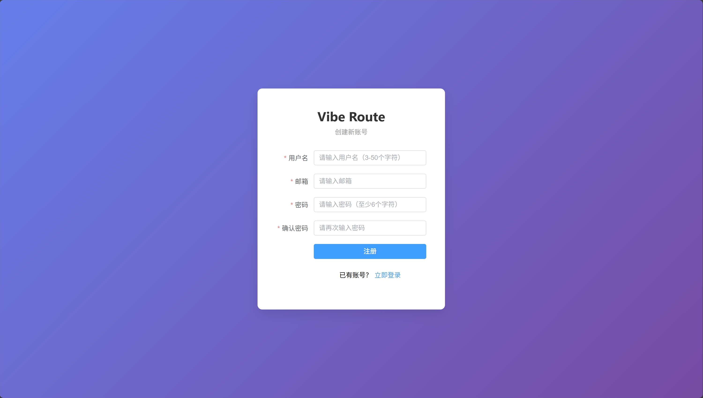
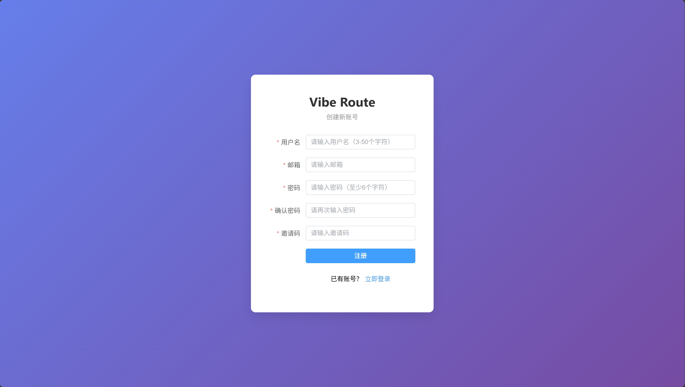
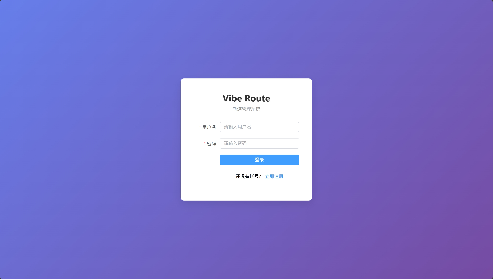

# 用户注册与登录

本文档介绍 Vibe Route 轨迹管理系统的用户注册和登录流程。

## 注册账户

### 注册页面

### 带邀请码注册

如果系统启用了邀请码功能，注册时需要输入有效的邀请码：

### 注册步骤

1. 访问系统首页，点击右上角"注册"按钮
2. 填写注册信息：
   - **用户名**：3-20 个字符，只能包含字母、数字、下划线
   - **邮箱**：有效的邮箱地址
   - **密码**：至少 8 个字符
   - **邀请码**（如需要）：输入有效的邀请码
3. 点击"注册"按钮完成注册

> **注意**：系统首位注册的用户将自动成为管理员。

---

## 登录系统

### 登录页面

### 登录步骤

1. 访问系统首页，点击右上角"登录"按钮
2. 输入用户名或邮箱和密码
3. 点击"登录"按钮

系统支持使用用户名或邮箱登录。

---

## 找回密码

如果忘记密码，请联系管理员重置密码。管理员可以在后台管理页面为用户重置密码。

---

## 移动端

移动端的注册和登录页面与桌面端类似，界面会自动适配手机屏幕。
