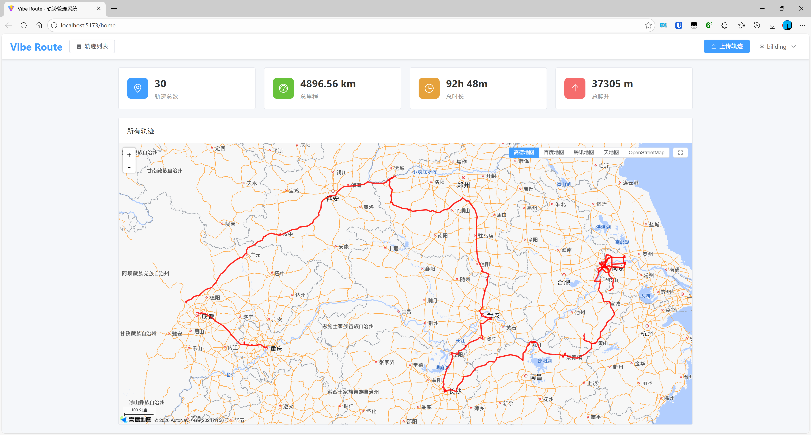
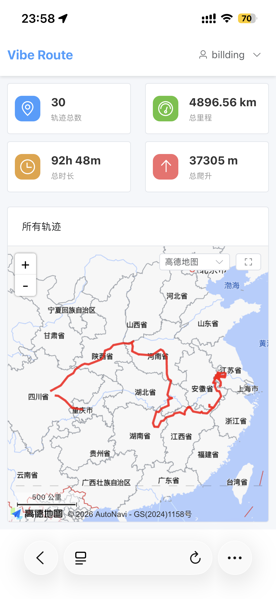
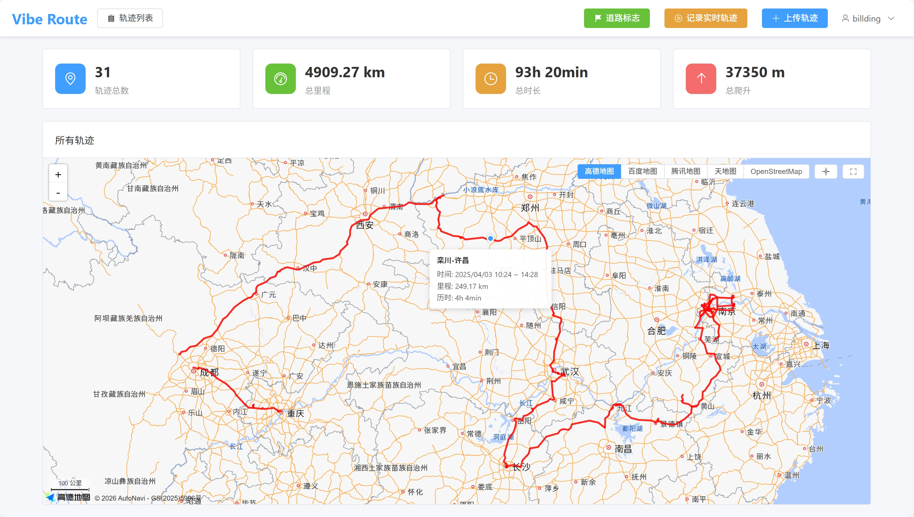
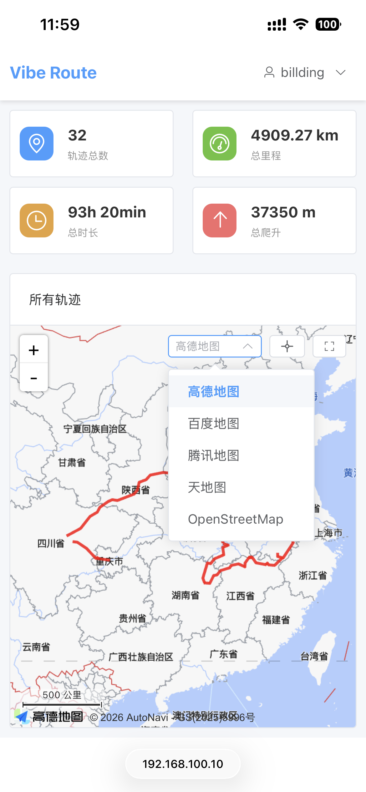

# 首页概览

登录后，首页显示轨迹统计和地图预览。

## 统计卡片

### 桌面端

首页顶部显示四个统计卡片：

- **轨迹数量**：已上传的轨迹总数
- **总距离**：所有轨迹的总里程
- **总时长**：所有轨迹的总历时
- **总爬升**：所有轨迹的总爬升高度

### 移动端

移动端使用 2x2 网格布局显示统计卡片。

---

## 地图预览

首页中央显示地图，展示所有轨迹。

### 桌面端交互

- **悬停轨迹**：显示轨迹名称、时间、里程、历时

- **点击轨迹**：跳转到轨迹详情页
- **居中按钮**：点击地图控制栏的居中按钮，自动调整视野以显示所有轨迹

### 移动端交互

- **点击轨迹**：显示轨迹信息提示框
- **点击轨迹卡片**：跳转到轨迹详情页
- **地图切换按钮**：在地图右上角

---

## 底图切换

点击地图右上角的底图切换按钮，可选择不同的地图提供商：

> 显示的地图提供商可由管理员在后台配置。

- 高德地图
- 百度地图
- 腾讯地图
- 天地图
- OpenStreetMap

### 桌面端

桌面端通过地图右上方的底图按钮，选择要使用的底图。

### 移动端

移动端通过地图右上方的选择框选择底图。
