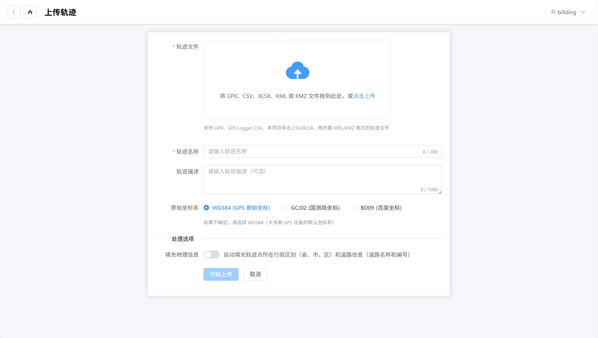

# 轨迹上传

本文档介绍如何上传轨迹文件到系统。

## 支持的文件格式

| 格式 | 说明 | 兼容性 |
|------|------|--------|
| GPX | 标准 GPS 交换格式 | 推荐 |
| CSV | 逗号分隔值，支持 GPS Logger 格式 | 需指定格式 |
| XLSX | Excel 表格格式 | 需指定格式 |
| KML | Google Earth 格式 | 支持 |
| KMZ | KML 压缩格式 | 支持 |

## 上传步骤

### 上传页面



1. 点击顶部导航栏的"上传轨迹"按钮
2. 填写轨迹信息：
   - **轨迹名称**（必填）
   - **描述**（可选）
3. 选择文件格式：
   - **自动检测**：系统自动识别格式
   - **手动指定**：从下拉菜单选择格式
4. 选择原始坐标系：
   - **WGS84**：GPS 原始坐标，推荐
   - **GCJ02**：中国火星坐标系
   - **BD09**：百度坐标系
5. 点击"选择文件"按钮，选择要上传的文件
6. 点击"上传"按钮

## CSV/XLSX 格式说明

### GPS Logger CSV 格式

标准 GPS Logger 应用导出的 CSV 格式：

```csv
lat,lon,alt,time,date,spd
39.9042,116.4074,50,12:30:45,2024-01-01,5.2
```

### 自定义 CSV/XLSX 格式

如果使用自定义格式，需要指定列名映射：

| 系统字段 | 可选列名 |
|----------|----------|
| 纬度 | lat, latitude, 纬度 |
| 经度 | lon, lng, longitude, 经度 |
| 海拔 | alt, altitude, ele, elevation, 海拔 |
| 时间 | time, time_time, 时间 |
| 日期 | date, time_date, 日期 |
| 速度 | spd, speed, 速度 |

## 上传后处理

上传完成后，系统会自动：

1. 解析轨迹点数据
2. 进行坐标系转换（WGS84、GCJ02、BD09）
3. 填充地理编码信息（行政区划、道路）
4. 计算统计信息（距离、时长、爬升）

对于大文件，系统使用异步任务处理，可以在任务列表查看进度。

## 移动端

移动端的上传页面与桌面端类似，界面会自动适配手机屏幕。
