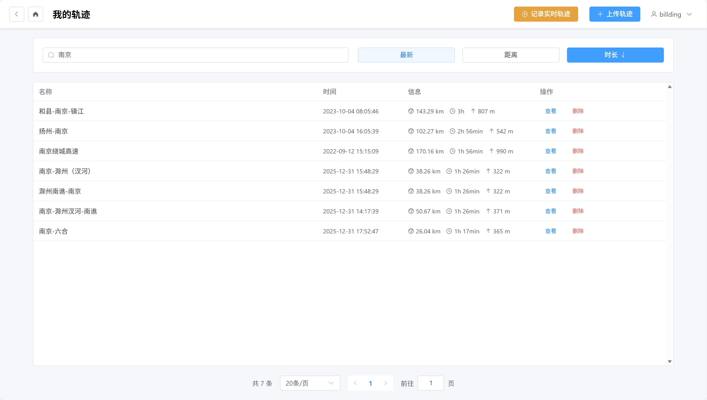
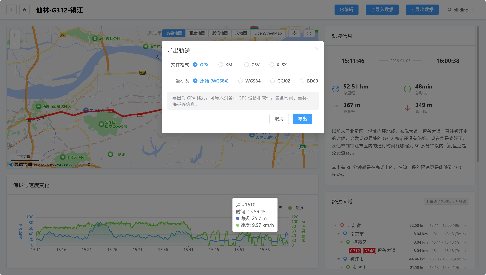
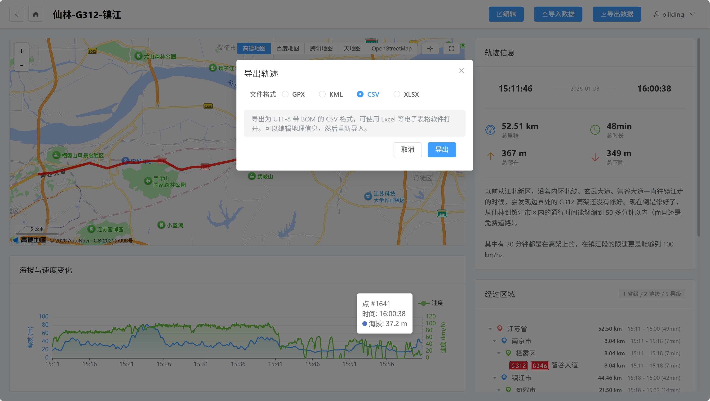
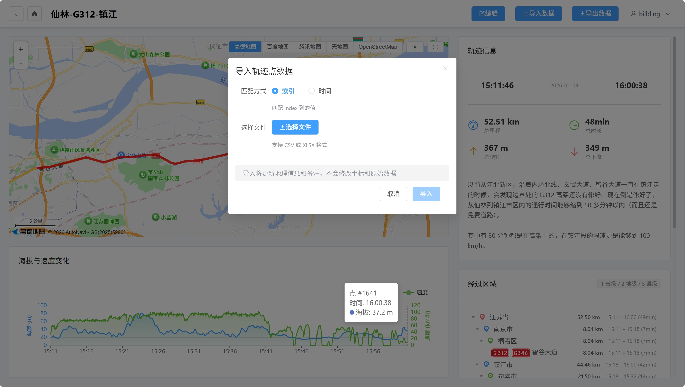
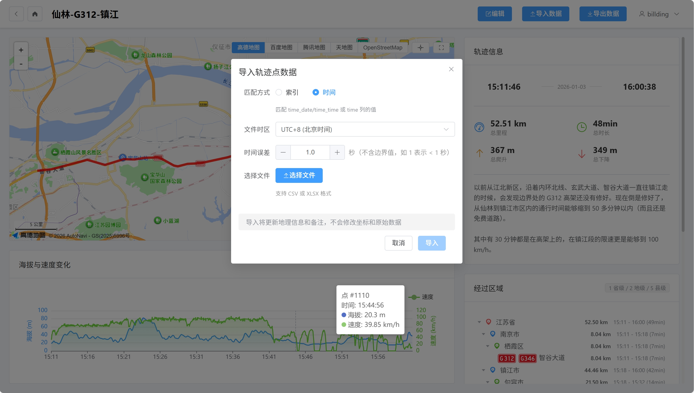

# 轨迹管理

本文档介绍如何管理和操作已上传的轨迹。

## 轨迹列表

### 桌面端

轨迹列表页面显示所有已上传的轨迹，包含以下信息：

- 轨迹名称
- 开始时间
- 距离、时长、爬升
- 操作按钮（编辑、删除）

### 移动端

移动端使用卡片列表显示轨迹。

---

## 搜索与排序

### 搜索

在搜索框中输入轨迹名称，系统会实时过滤显示结果。

### 排序

点击排序按钮，可按以下方式排序：

- **开始时间**：最新或最旧
- **距离**：最长或最短
- **时长**：最长或最短

---

## 查看轨迹

点击轨迹卡片或列表项，进入轨迹详情页。

详情页包含：

- 地图显示轨迹路径
- 海拔和速度图表
- 经过区域信息
- 轨迹点列表

---

## 编辑轨迹

点击轨迹卡片上的"编辑"按钮，可修改：

- 轨迹名称
- 描述
- 原始坐标系

修改坐标系后，系统会重新计算其他坐标系的坐标。

---

## 删除轨迹

点击轨迹卡片上的"删除"按钮，确认后删除轨迹。

---

## 轨迹导出

在轨迹详情页，点击"导出数据"按钮，可选择以下格式导出：

### 导出对话框

### 支持的导出格式

#### GPX 格式

- 标准的 GPS 交换格式
- 支持选择导出坐标系
- 兼容大多数 GPS 设备和软件

#### KML 格式

- Google Earth 格式
- 使用 Google gx:Track 扩展
- 支持导入 Google Earth 等应用

#### CSV 格式

- UTF-8 编码带 BOM
- 确保 Excel 正确显示中文
- 包含所有轨迹点信息

#### XLSX 格式

- Excel 表格格式
- 本系统特有格式
- 包含所有轨迹点信息

---

## 数据导入

在轨迹详情页，点击"导入数据"按钮，可导入外部数据补充轨迹信息。

### 导入对话框

### 支持的格式

- CSV
- XLSX

### 导入内容

- 行政区划信息（省、市、区）
- 道路信息（道路编号、道路名称）

### 匹配方式

- **索引匹配**：按轨迹点索引匹配。
- **时间匹配**：按时间戳匹配。可以调整时区和时间误差。

