# 轨迹详情

本文档介绍轨迹详情页的各项功能和交互方式。

## 页面布局

### 桌面端

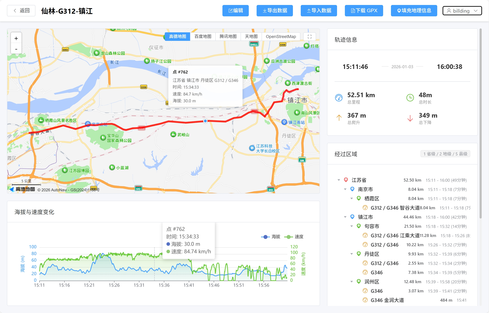

桌面端采用左右分栏布局：
- 左侧：地图 + 图表
- 右侧：经过区域 + 统计信息 + 轨迹点列表

### 移动端

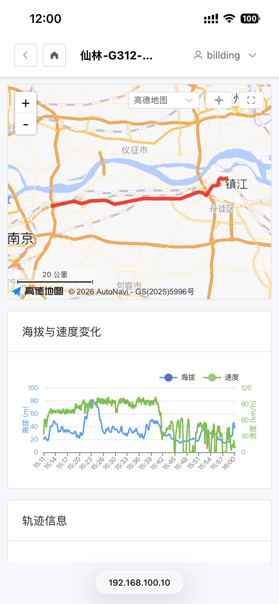

移动端采用单列流式布局，所有内容垂直排列。

---

## 页面区域

### 顶部信息栏

- 轨迹名称
- 实时记录状态（如果是实时记录）
- 操作按钮：编辑、导入数据、导出数据、删除

### 地图区域

- 显示轨迹路径
- 悬停/点击轨迹点显示详细信息
- 经过区域高亮
- 底图切换
- 居中按钮

### 图表区域

- **海拔剖面图**：显示海拔变化趋势
- **速度曲线图**：显示速度变化趋势

鼠标悬停在图表上时，地图上对应点会高亮显示。

### 经过区域

树形结构显示轨迹经过的行政区划和道路：

- **省**：点击高亮该省内所有轨迹段
- **市**：点击高亮该市内所有轨迹段
- **区**：点击高亮该区内所有轨迹段
- **道路**：点击高亮该道路上所有轨迹段，并显示道路标志

### 统计信息

- **距离**：轨迹总里程
- **时长**：轨迹总历时
- **爬升**：总爬升高度
- **平均速度**：平均移动速度
- **最高点**：轨迹最高海拔
- **最低点**：轨迹最低海拔

### 轨迹点列表

显示所有轨迹点的详细信息：

- 序号
- 时间
- 坐标（三种坐标系）
- 海拔
- 速度

---

## 地图交互

### 桌面端

- **悬停轨迹点**：显示点信息提示框
- **悬停图表**：地图同步高亮对应点

### 移动端

- **点击轨迹点**：显示点信息提示框
- **点击图表**：地图同步高亮对应点

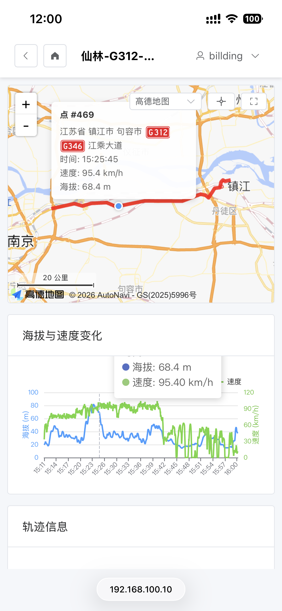

---

## 经过区域高亮

点击"经过区域"树中的任何项目，地图上对应的路径段会显示为蓝色高亮。

道路项目会同时显示对应的道路标志（如 G221、豫S88 等）。

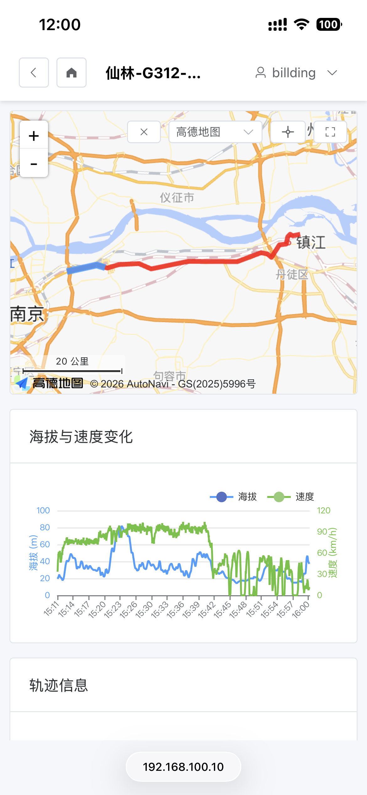

---

## 底图切换

轨迹详情页支持多种底图：

### 高德地图

默认底图，提供清晰的地图显示。

### 百度地图

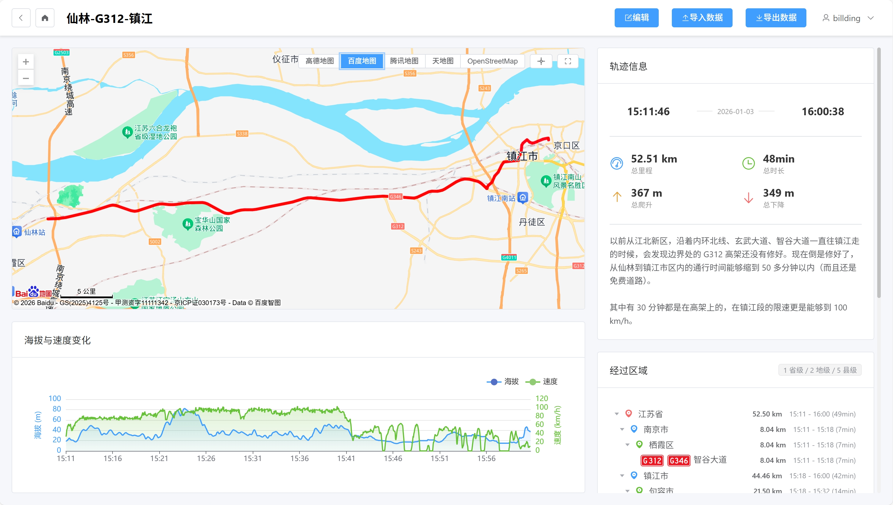

### 腾讯地图

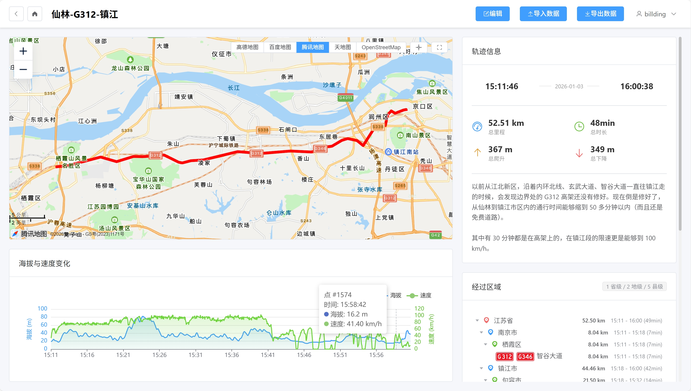

### 天地图

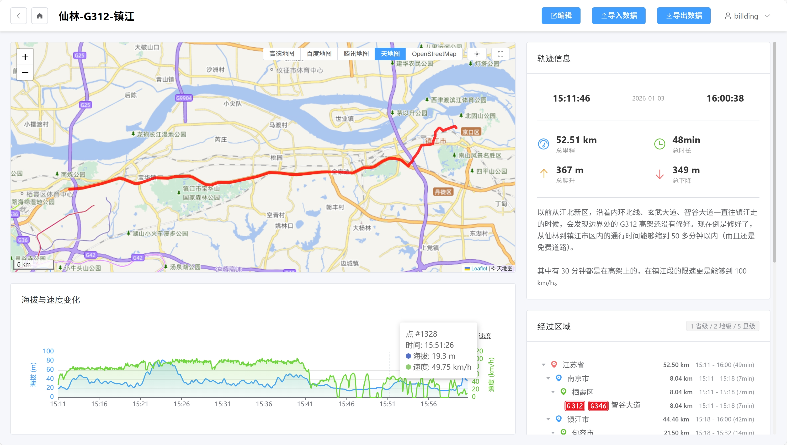

### OpenStreetMap

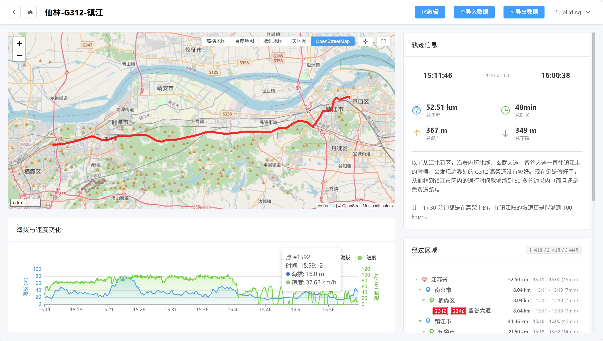

---

## 移动端完整视图

移动端向下滚动可以查看完整内容：

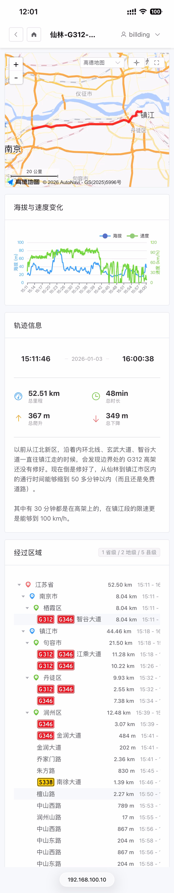

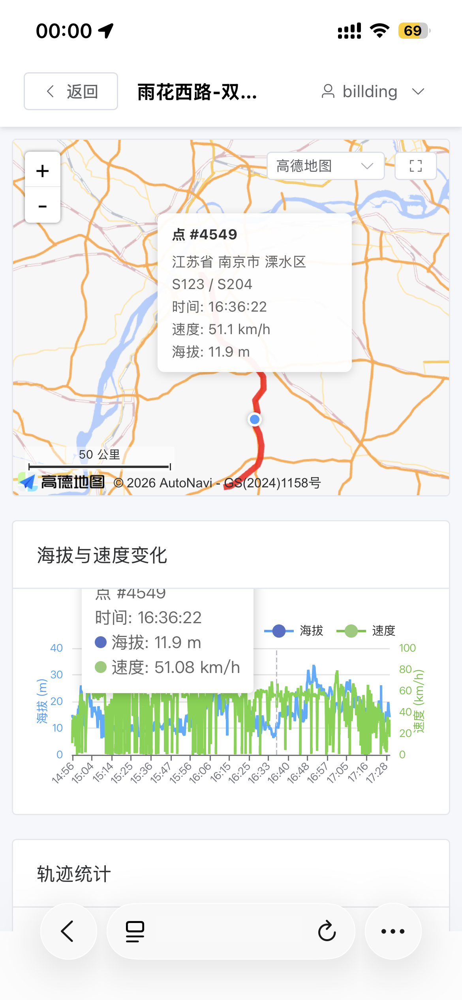

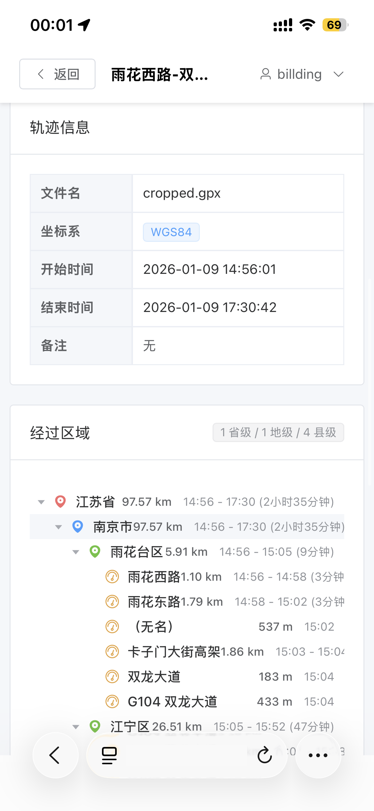
