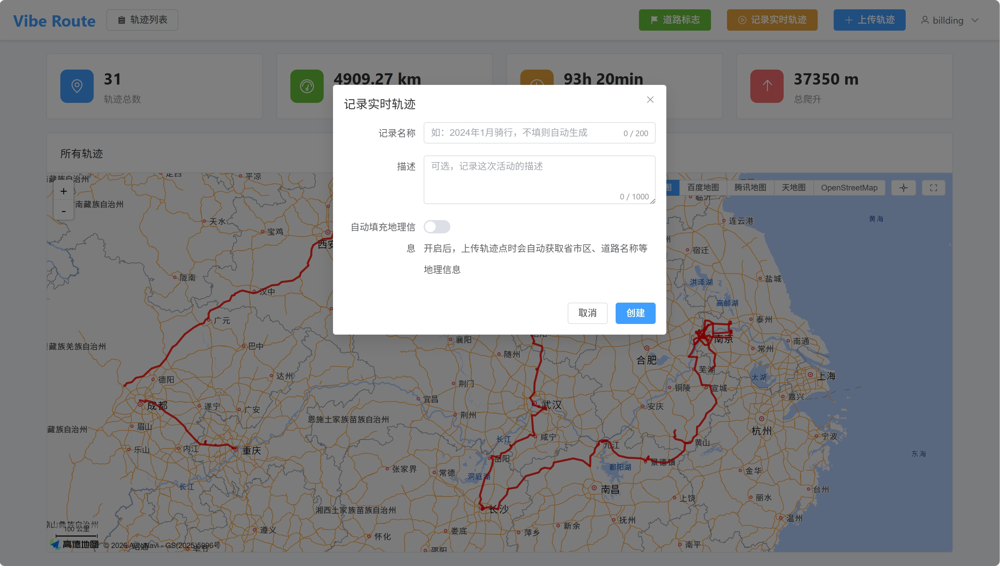
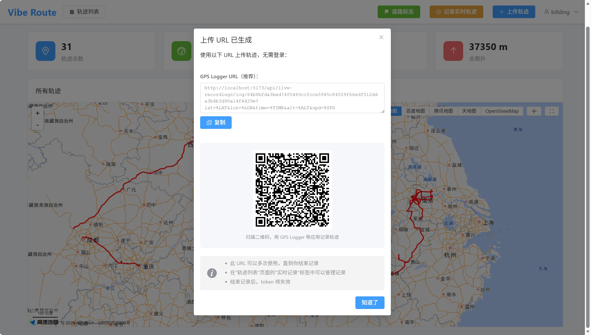
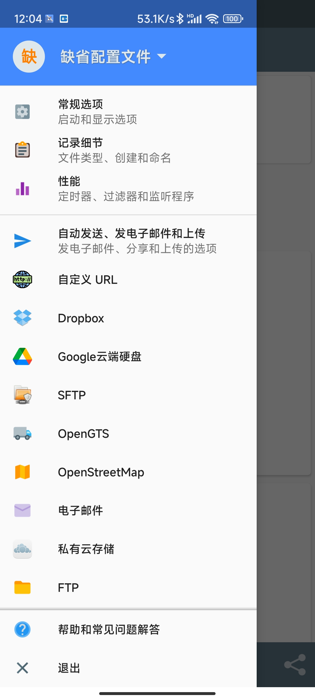
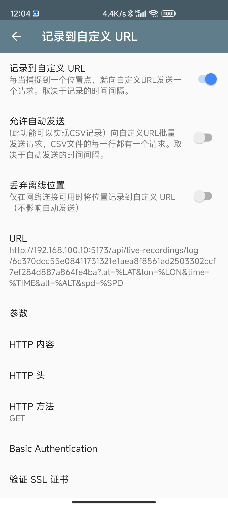
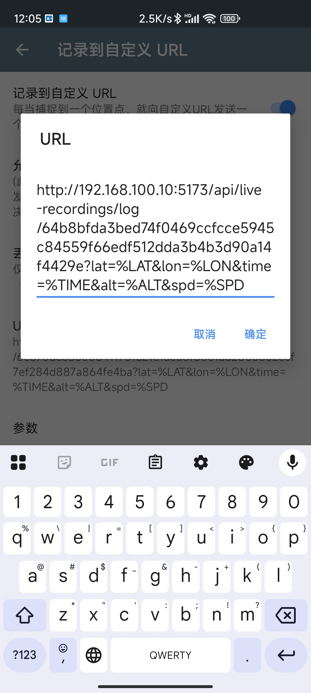
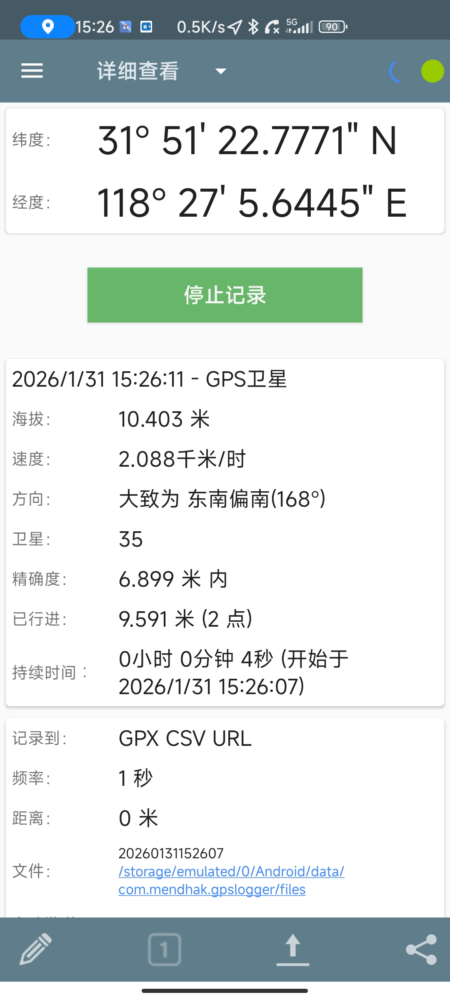
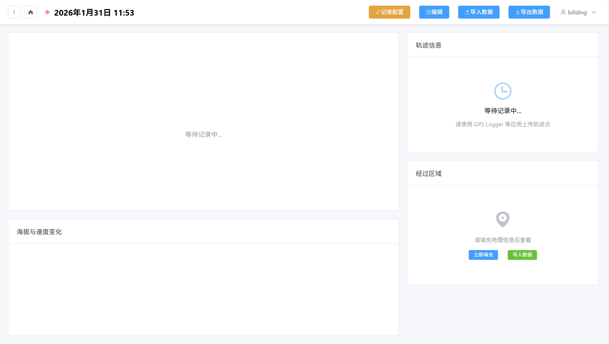
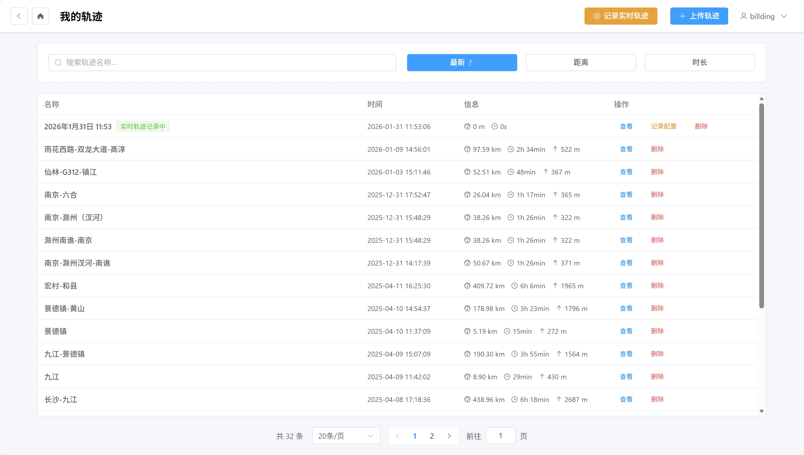
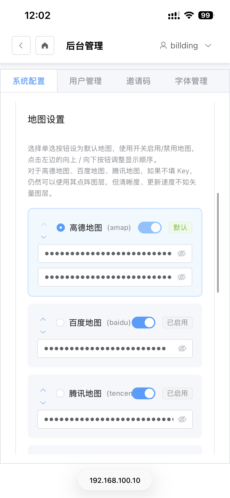

# 实时记录

本文档介绍如何使用实时轨迹记录功能。

## 创建实时记录会话

### 打开创建对话框

点击顶部导航栏的"记录实时轨迹"按钮。

### 填写会话信息



1. 填写会话信息：
   - **轨迹名称**（必填）
   - **描述**（可选）
2. 点击"创建"按钮

系统会生成一个上传 URL 和 Token。

### 创建成功



创建成功后，系统会自动打开轨迹详情页。

---

## 配置 GPS Logger

使用 GPS Logger 等应用配置上传 URL。

### 上传 URL 格式

```
https://route.a4ding.com/api/live-recordings/log/{TOKEN}?lat=%LAT&lon=%LON&time=%TIME&alt=%ALT&spd=%SPD
```

### GPS Logger 配置步骤

1. 打开 GPS Logger （GPS 记录器）应用
2. 侧栏里找到“自定义 URL”
   
3. 打开“记录到自定义 URL”
   
4. ，在 URL 里填入系统生成的上传 URL
   
5. 然后就可以开始记录了
   

当需要停止记录时，不要在停止记录后立即结束应用，更不要立即结束轨迹（见下），因为后台可能还在传输轨迹点信息。

---

## 实时查看

### 初始状态



刚创建时，轨迹详情页显示为空，等待 GPS Logger 上传数据。

### 接收数据

开始接收数据后：
- 地图实时显示新添加的轨迹点
- 统计信息自动更新
- 顶部显示实时记录状态

### 状态指示

- 🔴 **红色闪动** - 实时轨迹记录中
- 🟡 **黄色** - 连接断开/有故障

---

## 查看实时记录列表

### 列表状态



在轨迹列表页，实时记录的轨迹会显示特殊状态标签：
- 显示"实时记录中"
- 显示最近更新时间

---

## 结束实时记录

1. 打开实时记录会话对话框
2. 点击"结束记录"按钮
3. 确认操作

结束后，轨迹会转换为普通轨迹，不再接收新数据。

---

## 删除实时记录

1. 打开实时记录会话对话框
2. 点击"删除"按钮
3. 确认操作

> **注意**：删除实时记录会同时删除关联的轨迹数据。

---

## 移动端

移动端的实时记录功能与桌面端类似，界面会自动适配手机屏幕。


