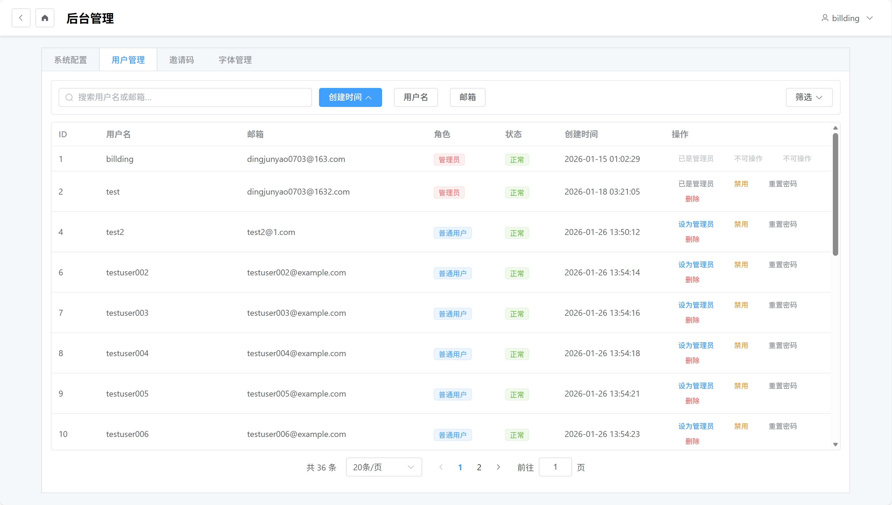
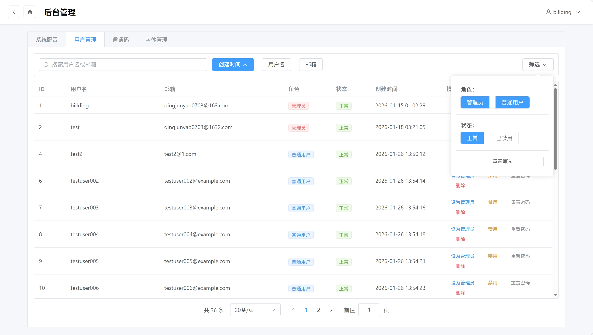
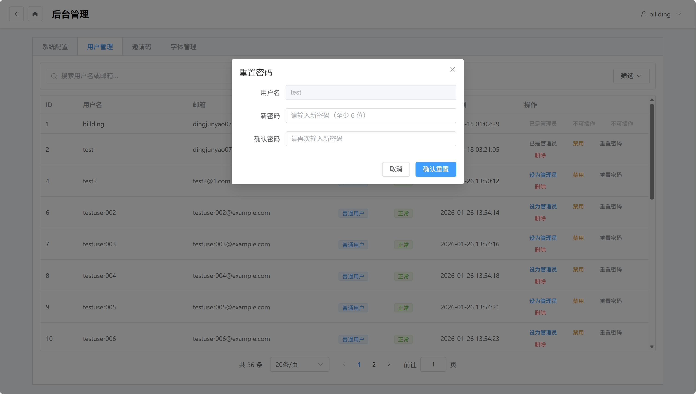
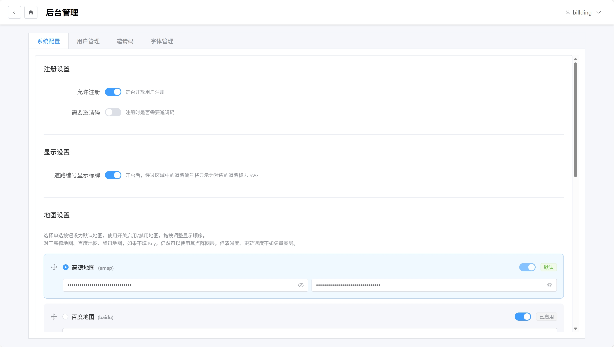
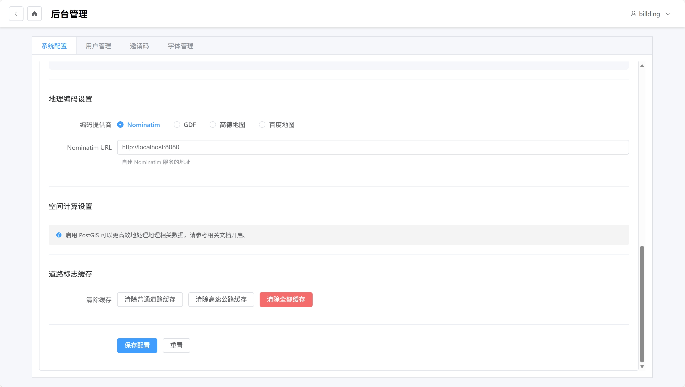
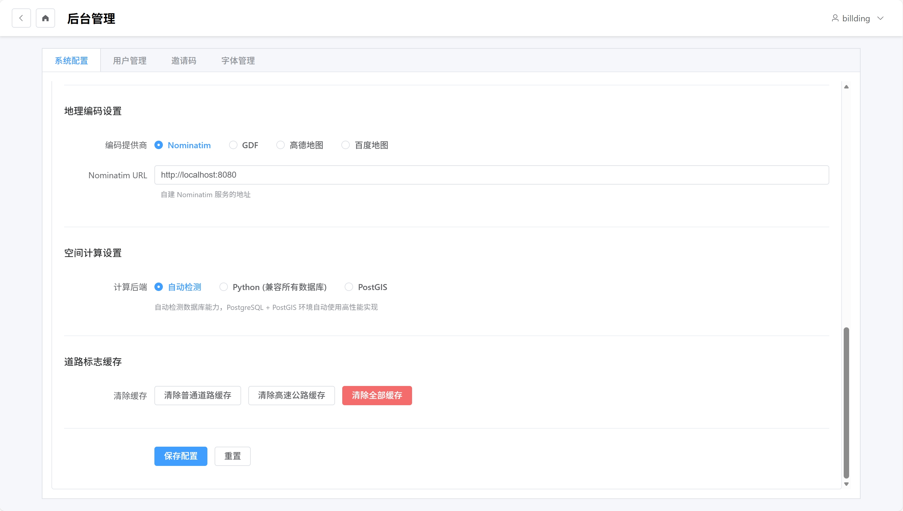
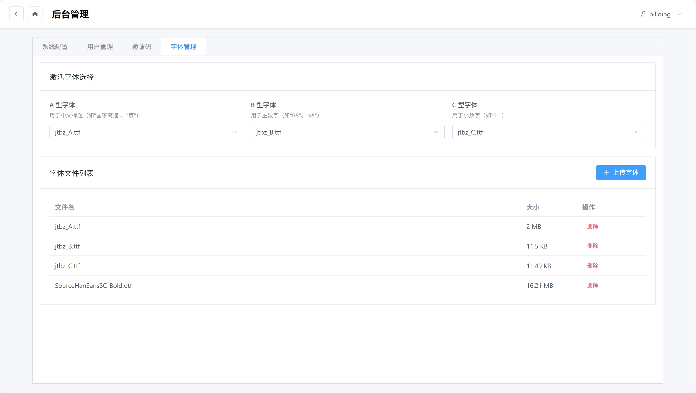
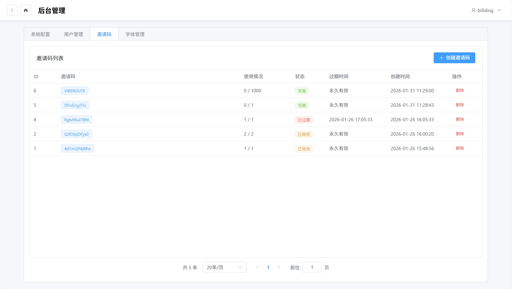
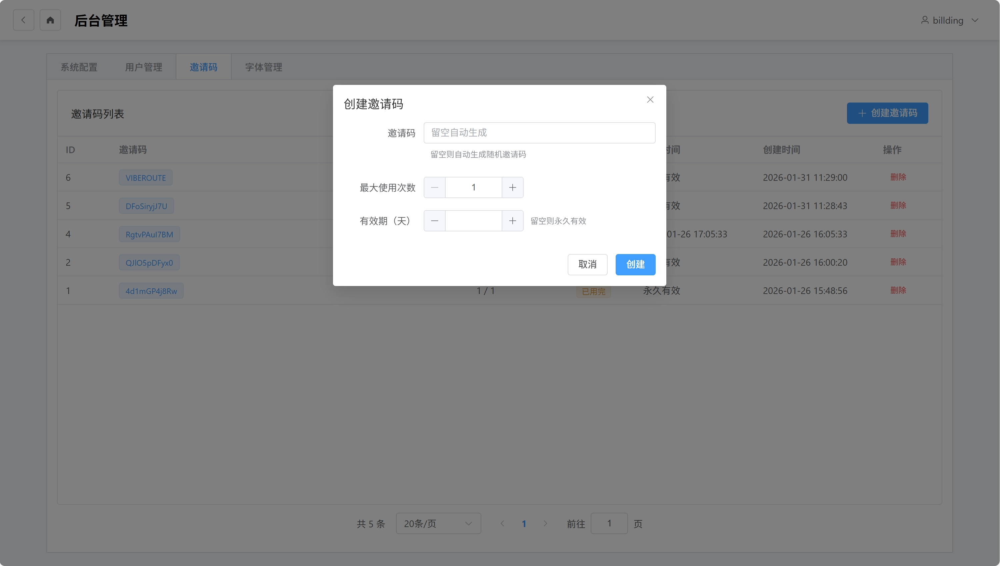

# 后台管理

> **注意**：后台管理功能仅对管理员用户开放。

本文档介绍系统的后台管理功能。

## 用户管理

### 用户列表

用户列表页面显示所有已注册用户，包括：

- 用户名
- 邮箱
- 角色（管理员/普通用户）
- 状态（启用/禁用）
- 注册时间
- 最后登录时间

### 搜索与筛选

#### 搜索

在搜索框中输入用户名或邮箱，系统会实时过滤显示结果。

#### 筛选

- **角色筛选**：全部/管理员/普通用户
- **状态筛选**：全部/启用/禁用

### 用户操作

#### 设置管理员

点击用户卡片上的"设置管理员"按钮，可以授予或取消管理员权限。

> **限制**：不能取消首位用户的管理员权限，必须保留至少一位管理员。

#### 禁用/启用

点击"禁用"或"启用"按钮，可以控制用户账户是否可以登录。

> **限制**：不能禁用自己的账户或首位用户。

#### 重置密码

点击"重置密码"按钮，可以将用户密码重置为默认值。

> **限制**：不能重置自己的密码或首位用户的密码。

#### 删除用户

点击"删除"按钮，确认后软删除用户。

> **限制**：不能删除自己的账户或首位用户。

---

## 系统配置

### 配置页面

系统配置页面包含多个设置选项卡。

#### 非 PostgreSQL 环境

#### PostgreSQL 环境

启用 PostGIS 后，可以看到空间计算选项：

### 注册设置

- **允许注册**：开启/关闭用户注册功能
- **需要邀请码**：注册时是否需要邀请码

### 地图配置

- **默认地图提供商**：选择默认地图
- **地图层配置**：配置各地图的图层

### 字体配置

- **道路标志字体**：设置 A/B/C 类型的激活字体

### 空间计算（PostgreSQL + PostGIS）

- **空间计算后端**：选择 auto / python / postgis
- **auto**：系统自动选择最优方案
- **python**：使用 Python 计算
- **postgis**：使用 PostGIS 空间计算（性能最佳）

---

## 邀请码管理

### 邀请码列表

显示所有邀请码及其状态：

- 邀请码
- 使用次数 / 最大次数
- 创建时间
- 过期时间
- 状态（有效/已用完/已过期）

### 创建邀请码

点击"创建邀请码"按钮：

1. 设置邀请码参数：
   - **使用次数**：最多可使用次数
   - **有效期**：邀请码过期时间
2. 点击"创建"按钮

系统会生成一个随机邀请码。

### 删除邀请码

点击邀请码的"删除"按钮，确认后删除。

---

## 移动端

移动端的后台管理界面与桌面端类似，布局会自动适配手机屏幕。
