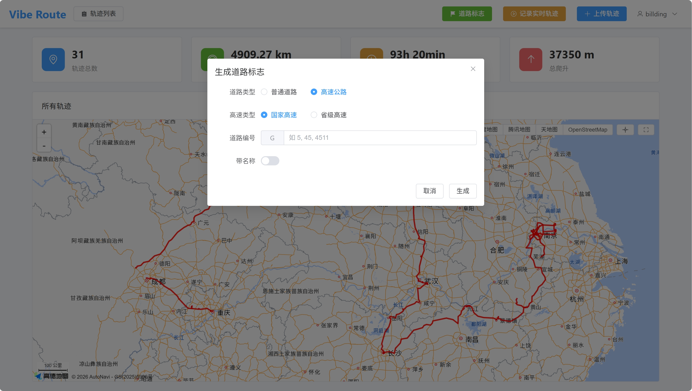
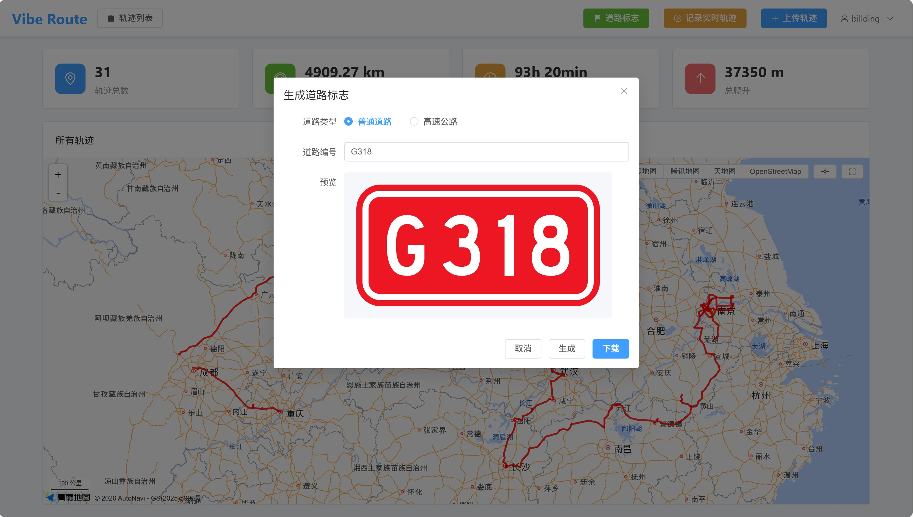
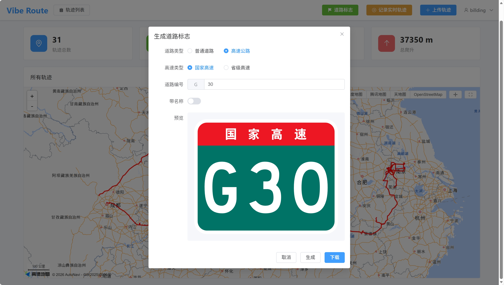
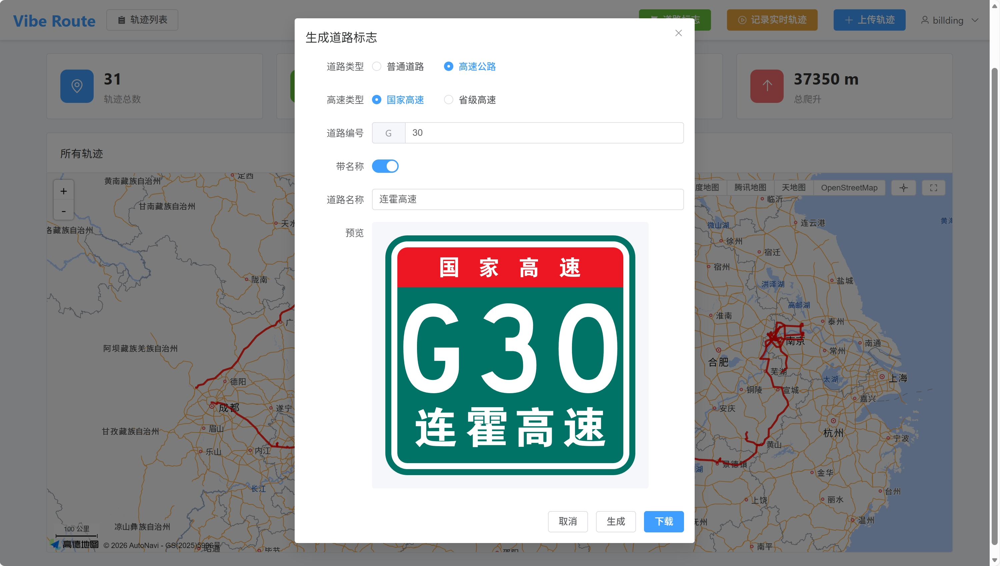
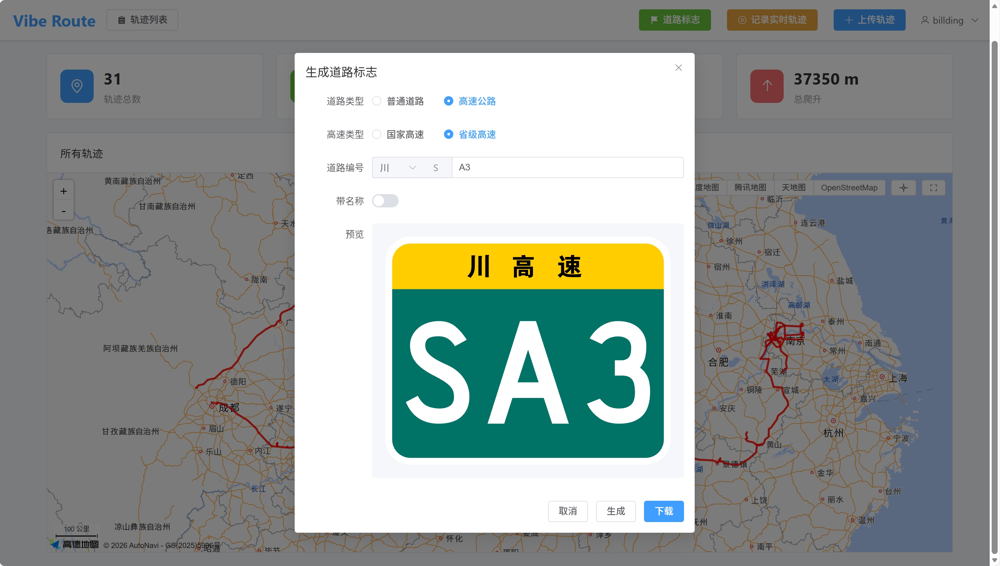
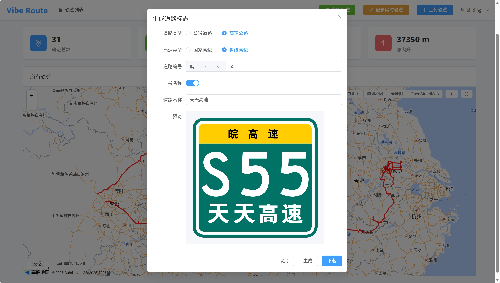

# 道路标志生成

本文档介绍如何使用道路标志生成工具创建符合中国标准的道路标志 SVG 图片。

## 功能说明

道路标志生成工具可以创建普通道路和高速公路的标志。

## 道路类型

### 普通道路

普通道路标志为红边白底矩形：

- **国道**：G + 三位数字（如 G221）
- **省道**：S + 三位数字（如 S221）
- **县道**：X + 三位数字（如 X221）

### 高速公路

高速公路标志为绿边绿底矩形：

#### 国家高速

- **G + 1-4 位数字**（如 G5、G1234）

#### 省级高速

- **S + 纯数字**（如 S88）
- **S + 字母 + 可选数字**（仅限四川省，如 SA、SB、SC）

---

## 生成步骤

### 普通道路

1. 选择道路类型：**普通道路**
2. 输入道路编号（如 `G221`、`豫S221`）
3. 点击"生成"按钮
4. 预览生成的标志
5. 点击"下载 SVG"按钮保存

### 国家高速

1. 选择道路类型：**高速公路**
2. 选择子类型：**国家高速**
3. 输入道路编号（如 `G5`）
4. 可选：输入道路名称（如 "京昆高速"）
5. 点击"生成"按钮
6. 预览生成的标志
7. 点击"下载 SVG"按钮保存

### 省级高速

1. 选择道路类型：**高速公路**
2. 选择子类型：**省级高速**
3. 输入道路编号（如 `S88`、`川SA`）
4. 可选：输入道路名称（如 "成绵高速"）
5. 点击"生成"按钮
6. 预览生成的标志
7. 点击"下载 SVG"按钮保存

---

## 省份前缀

省级道路可使用省份前缀：

| 省份 | 前缀 | 省份 | 前缀 |
|------|------|------|------|
| 北京 | 京 | 天津 | 津 |
| 河北 | 冀 | 山西 | 晋 |
| 内蒙古 | 蒙 | 辽宁 | 辽 |
| 吉林 | 吉 | 黑龙江 | 黑 |
| 上海 | 沪 | 江苏 | 苏 |
| 浙江 | 浙 | 安徽 | 皖 |
| 福建 | 闽 | 江西 | 赣 |
| 山东 | 鲁 | 河南 | 豫 |
| 湖北 | 鄂 | 湖南 | 湘 |
| 广东 | 粤 | 广西 | 桂 |
| 海南 | 琼 | 重庆 | 渝 |
| 四川 | 川 | 贵州 | 贵 |
| 云南 | 云 | 西藏 | 藏 |
| 陕西 | 陕 | 甘肃 | 甘 |
| 青海 | 青 | 宁夏 | 宁 |
| 新疆 | 新 | | |

---

## 使用场景

生成的道路标志 SVG 可用于：

1. **轨迹经过区域显示**：在轨迹详情页，经过的道路会自动显示对应的道路标志
2. **视频制作**：配合覆盖层生成工具使用
3. **文档制作**：用于各类文档和报告

---

## 技术说明

- 输出格式：SVG
- 编码：UTF-8
- 兼容性：支持所有现代浏览器和图形软件
