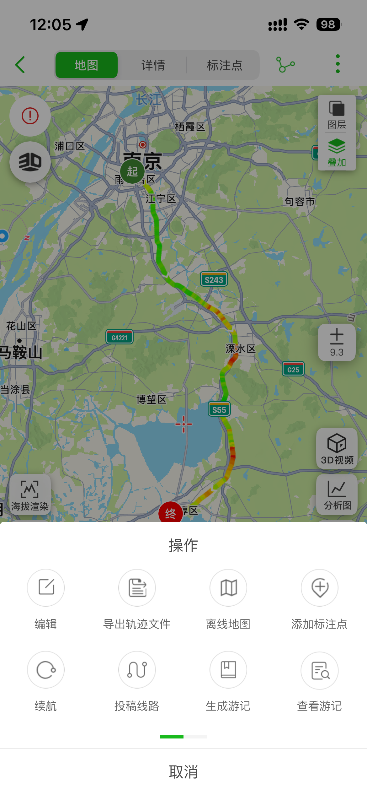
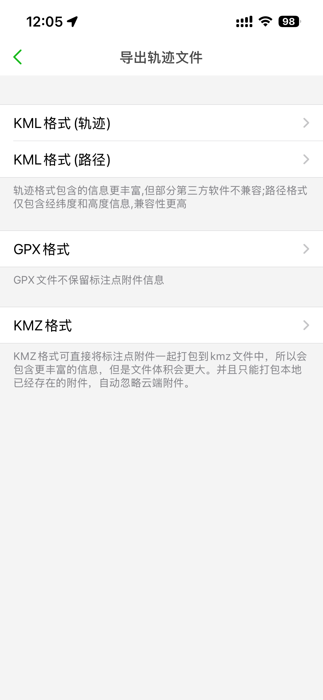

# 覆盖层生成

> 该功能还未开发。

本文档介绍如何使用覆盖层生成工具创建带有轨迹信息的图片序列。

## 功能说明

覆盖层生成工具可以创建带有轨迹信息的图片序列，用于视频制作等用途。

## 配置选项

### 图片设置

- **宽度**：输出图片宽度（像素）
- **高度**：输出图片高度（像素）
- **字体大小**：文字大小

### 显示内容

可选择显示以下信息：

- 坐标（经纬度）
- 海拔
- 时间
- 速度
- 道路信息

## 导出按钮位置

在轨迹详情页，可以找到导出按钮。

## 导出格式选择

点击导出按钮后，可以选择不同的导出格式。

选择"覆盖层图片（ZIP）"可以生成覆盖层图片序列。

## 生成步骤

1. 在轨迹详情页点击"导出数据"按钮
2. 选择导出格式为"覆盖层图片（ZIP）"
3. 配置图片尺寸和字体大小
4. 选择要显示的内容
5. 点击"导出"按钮
6. 等待异步任务完成
7. 下载生成的 ZIP 文件

## 输出格式

生成的 ZIP 文件包含：

- 一系列 PNG 图片，按轨迹点顺序命名
- 每张图片对应一个轨迹点，显示配置的信息
- 文件名格式：`{序号:04d}.png`

## 使用场景

生成的覆盖层图片可用于：

1. **视频制作**：配合视频编辑软件，将信息叠加到视频上
2. **轨迹回放**：创建带有信息显示的轨迹回放动画
3. **数据分析**：用于生成轨迹分析报告的可视化内容

## 注意事项

- 大量轨迹点可能需要较长的处理时间
- 生成的 ZIP 文件大小取决于图片尺寸和轨迹点数量
- 建议根据实际需要选择合适的图片尺寸
